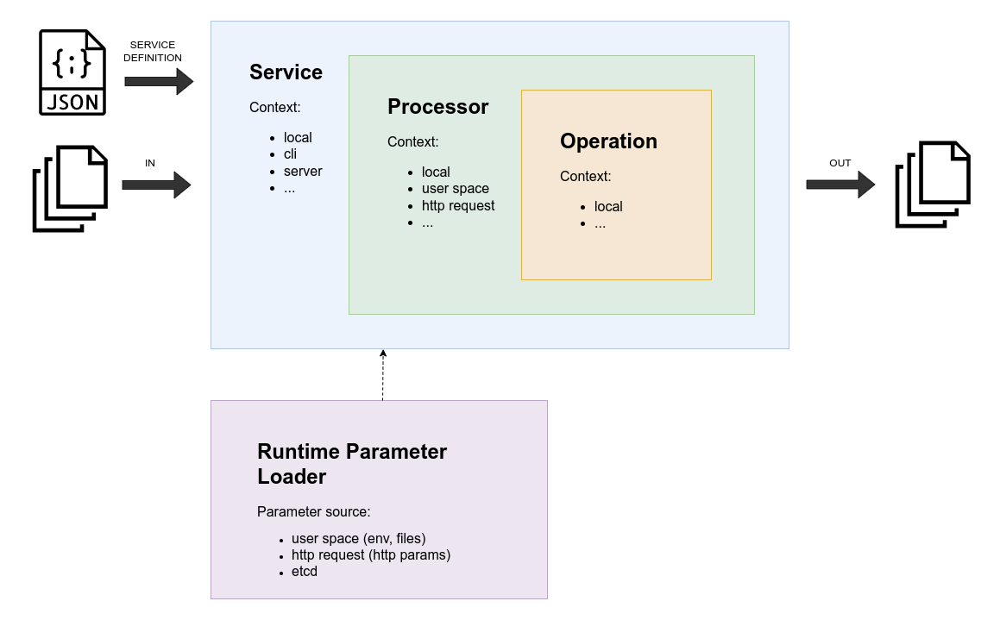

<p align="center">
  
</p>

**Capyfile** - highly customizable file processing pipeline 

What we are pursuing here:
* Easy setup
* High customization
* Wide range of file processing operations

## How to use

File processing pipeline can be set up in **two simple steps**.

### 1. Prepare the service definition file.

The service definition file is a file that describes the file processing pipeline. This file
can be JSON or YAML.

Top level of the configuration file is the `service` object. It holds the processors that
hold the operations.

Available operations are:
* `http_multipart_form_input_read` - read the files from the HTTP request body as `multipart/form-data` (`capysvr` only)
* `http_octet_stream_input_read` - read the files from the HTTP request body as `application/octet-stream` (`capysvr` only)
* `filesystem_input_read` - read the files from the filesystem
* `filesystem_input_write` - write the files to the filesystem
* `filesystem_input_remove` - remove the files from the filesystem
* `file_size_validate` - check file size
* `file_type_validate` - check file MIME type
* `file_time_validate` - check file time stat
* `axiftool_metadata_cleanup` - clear file metadata if possible (require exiftool)
* `image_convert` - convert image to another format (require libvips)
* `s3_upload` - upload file to S3-compatible storage
* ... will be more

Operation parameters can be retrieved from those source types:
* `value` - parameter value will be retrieved from the service definition
* `env_var` - parameter value will be retrieved from the environment variable
* `secret` - parameter value will be retrieved from the secret (docker secret)
* `file` - parameter value will be retrieved from the file
* `http_get` - parameter value will be retrieved from the HTTP GET parameter
* `http_post` - parameter value will be retrieved from the HTTP POST parameter
* `http_header` - parameter value will be retrieved from the HTTP header
* `etcd` - parameter value will be retrieved from the etcd key-value store
* ... will be more

Each operation accepts `targetFiles` parameter that tells the operation what files it should
process. The `targetFiles` parameter can have these values:
* `without_errors` (default) - all files that are passed to the operation except files that 
  have errors
* `with_errors` - all files that are passed to the operation that have errors
* `all` - all files that are passed to the operation


### 2. Run the file processing pipeline.

At this moment you have two options to run the file processing pipeline:
* via `capycmd` command line application
* via `capysvr` http server

## Examples

The below you can see a couple of examples of the service definition file.

### Log archiver example

First example is a typical service definition file for the `capycmd` command line application. 
This service definition setting up a pipeline that reads the log files from the filesystem,
uploads the files that are older than 30 days to S3-compatible storage and removes them.
```yaml
---
version: '1.1'
name: logs
processors:
  - name: archive
    operations:
      - name: filesystem_input_read
        params:
          target:
            sourceType: value
            source: "/var/log/rotated-logs/*"
      - name: file_time_validate
        params:
          maxMtime:
            sourceType: env_var
            source: MAX_LOG_FILE_AGE_RFC3339
      - name: s3_upload
        targetFiles: without_errors
        params:
          accessKeyId:
            sourceType: secret
            source: aws_access_key_id
          secretAccessKey:
            sourceType: secret
            source: aws_secret_access_key
          endpoint:
            sourceType: value
            source: s3.amazonaws.com
          region:
            sourceType: value
            source: us-east-1
          bucket:
            sourceType: env_var
            source: AWS_LOGS_BUCKET
      - name: filesystem_input_remove
        targetFiles: without_errors
```

Now when you have a service definition file, you can run the file processing pipeline.
```bash
# Provide service definition stored in the local filesystem 
# via CAPYFILE_SERVICE_DEFINITION_FILE=/etc/capyfile/service-definition.json
docker run \
    --name capyfile_cmd \
    --mount type=bind,source=./service-definition.yml,target=/etc/capyfile/service-definition.yml \
    --mount type=bind,source=/var/log/rotated-logs,target=/var/log/rotated-logs \
    --env CAPYFILE_SERVICE_DEFINITION_FILE=/etc/capyfile/service-definition.yml \
    --env MAX_LOG_FILE_AGE_RFC3339=$(date -d "30 days ago" -u +"%Y-%m-%dT%H:%M:%SZ") \
    --env AWS_LOGS_BUCKET=logs \
    --secret aws_access_key_id \
    --secret aws_secret_access_key \
    capyfile/capycmd:latest logs:archive
```

The command produces the output that can look like this (the output has weird order because 
it is a result of concurrent processing):
```
Running logs:archive service processor...

[/var/log/rotated-logs/access-2023-08-27.log] filesystem_input_read FINISHED file read finished
[/var/log/rotated-logs/access-2023-08-28.log] filesystem_input_read FINISHED file read finished
[/var/log/rotated-logs/access-2023-09-27.log] filesystem_input_read FINISHED file read finished
[/var/log/rotated-logs/access-2023-09-28.log] filesystem_input_read FINISHED file read finished
[/var/log/rotated-logs/access-2023-09-29.log] filesystem_input_read FINISHED file read finished
[/var/log/rotated-logs/access-2023-08-28.log] file_time_validate STARTED file time validation started
[/var/log/rotated-logs/access-2023-08-28.log] file_time_validate FINISHED file time is valid
[/var/log/rotated-logs/access-2023-08-27.log] file_time_validate STARTED file time validation started
[/var/log/rotated-logs/access-2023-09-27.log] file_time_validate STARTED file time validation started
[/var/log/rotated-logs/access-2023-08-27.log] file_time_validate FINISHED file time is valid
[/var/log/rotated-logs/access-2023-09-27.log] file_time_validate FINISHED file mtime is too new
[/var/log/rotated-logs/access-2023-09-29.log] file_time_validate STARTED file time validation started
[/var/log/rotated-logs/access-2023-09-27.log] s3_upload SKIPPED skipped due to "without_errors" target files policy
[/var/log/rotated-logs/access-2023-09-28.log] file_time_validate STARTED file time validation started
[/var/log/rotated-logs/access-2023-09-29.log] file_time_validate FINISHED file mtime is too new
[/var/log/rotated-logs/access-2023-08-28.log] s3_upload STARTED S3 file upload has started
[/var/log/rotated-logs/access-2023-09-28.log] file_time_validate FINISHED file mtime is too new
[/var/log/rotated-logs/access-2023-09-29.log] s3_upload SKIPPED skipped due to "without_errors" target files policy
[/var/log/rotated-logs/access-2023-08-27.log] s3_upload STARTED S3 file upload has started
[/var/log/rotated-logs/access-2023-09-27.log] filesystem_input_remove SKIPPED skipped due to "without_errors" target files policy
[/var/log/rotated-logs/access-2023-09-29.log] filesystem_input_remove SKIPPED skipped due to "without_errors" target files policy
[/var/log/rotated-logs/access-2023-09-28.log] s3_upload SKIPPED skipped due to "without_errors" target files policy
[/var/log/rotated-logs/access-2023-09-28.log] filesystem_input_remove SKIPPED skipped due to "without_errors" target files policy
[/var/log/rotated-logs/access-2023-08-27.log] s3_upload FINISHED S3 file upload has finished
[/var/log/rotated-logs/access-2023-08-28.log] s3_upload FINISHED S3 file upload has finished
[/var/log/rotated-logs/access-2023-08-27.log] filesystem_input_remove STARTED file remove started
[/var/log/rotated-logs/access-2023-08-27.log] filesystem_input_remove FINISHED file remove finished
[/var/log/rotated-logs/access-2023-08-28.log] filesystem_input_remove STARTED file remove started
[/var/log/rotated-logs/access-2023-08-28.log] filesystem_input_remove FINISHED file remove finished
...
````

### Document uploader example

This service definition setting up a pipeline that allows .pdf, .doc and .docx files that are
less than 10MB. Valid files will be uploaded to S3-compatible storage.
```yaml
---
version: '1.1'
name: documents
processors:
  - name: upload
    operations:
      - name: http_multipart_form_input_read
      - name: file_size_validate
        params:
          maxFileSize:
            sourceType: value
            source: 1048576
      - name: file_type_validate
        params:
          allowedMimeTypes:
            sourceType: value
            source:
              - application/pdf
              - application/msword
              - application/vnd.openxmlformats-officedocument.wordprocessingml.document
      - name: s3_upload
        params:
          accessKeyId:
            sourceType: secret
            source: aws_access_key_id
          secretAccessKey:
            sourceType: secret
            source: aws_secret_access_key
          endpoint:
            sourceType: etcd
            source: "/services/upload/aws_endpoint"
          region:
            sourceType: etcd
            source: "/services/upload/aws_region"
          bucket:
            sourceType: env_var
            source: AWS_DOCUMENTS_BUCKET

```

Now when you have a service definition file, you can run the file processing pipeline 
available over HTTP.
```bash
# Provide service definition stored in the local filesystem 
# via CAPYFILE_SERVICE_DEFINITION_FILE=/etc/capyfile/service-definition.yml
docker run \
    --name capyfile_server \
    --mount type=bind,source=./service-definition.yml,target=/etc/capyfile/service-definition.yml \
    --env CAPYFILE_SERVICE_DEFINITION_FILE=/etc/capyfile/service-definition.yml \
    --env AWS_DOCUMENTS_BUCKET=documents \
    --secret aws_access_key_id \
    --secret aws_secret_access_key \
    -p 8024:80 \
    capyfile/capysvr:latest

# Or you can provide the service definition stored in the remote host 
# via CAPYFILE_SERVICE_DEFINITION_URL=https://example.com/service-definition.json
docker run \
    --name capyfile_server \
    --env CAPYFILE_SERVICE_DEFINITION_URL=https://example.com/service-definition.json \
    --env AWS_DOCUMENTS_BUCKET=documents \
    --secret aws_access_key_id \
    --secret aws_secret_access_key \
    -p 8024:80 \
    capyfile/capysvr:latest
```

If you want to load parameters from etcd, you can provide the etcd connection parameters via
environment variables:
```
ETCD_ENDPOINTS=["etcd1:2379","etcd2:22379","etcd3:32379"]
ETCD_USERNAME=etcd_user
ETCD_PASSWORD=etcd_password
```

Now it is ready to accept and process the files.
```bash
# upload and process single file
curl -F "file1=@$HOME/Documents/document.pdf" http://localhost/upload/document 

# upload and process request body
curl --data-binary "@$HOME/Documents/document.pdf" http://localhost/upload/document 

# upload and process multiple files
curl -F "file1=@$HOME/Documents/document.pdf" http://localhost/upload/document 
curl \
    -F "file1=@$HOME/Documents/document.pdf" \
    -F "file3=@$HOME/Documents/document.docx" \
    -F "file3=@$HOME/Documents/very-big-document.pdf" \
    -F "file4=@$HOME/Documents/program.run" \
    http://localhost/upload/document 
```

The service returns json response of this format (example for multiple files upload above):
```json
{
  "status": "PARTIAL",
  "code": "PARTIAL",
  "message": "successfully uploaded 2 of 4 files",
  "files": [
    {
      "url": "https://documents.storage.example.com/documents/abcdKDNJW_DDWse.pdf",
      "filename": "abcdKDNJW_DDWse.pdf",
      "originalFilename": "document.pdf",
      "mime": "application/pdf",
      "size": 5892728,
      "status": "SUCCESS",
      "code": "FILE_SUCCESSFULLY_UPLOADED",
      "message": "file successfully uploaded"
    },
    {
      "url": "https://documents.storage.example.com/documents/abcdKDNJW_DDWsd.docx",
      "filename": "abcdKDNJW_DDWsd.docx",
      "originalFilename": "document.docx",
      "mime": "application/vnd.openxmlformats-officedocument.wordprocessingml.document",
      "size": 3145728,
      "status": "SUCCESS",
      "code": "FILE_SUCCESSFULLY_UPLOADED",
      "message": "file successfully uploaded"
    }
  ],
  "errors": [
    {
      "originalFilename": "very-big-document.pdf",
      "status": "ERROR",
      "code": "FILE_IS_TOO_BIG",
      "message": "file size can not be greater than 10 MB"
    },
    {
      "originalFilename": "program.run",
      "status": "ERROR",
      "code": "FILE_MIME_TYPE_IS_NOT_ALLOWED",
      "message": "file MIME type \"application/x-makeself\" is not allowed"
    }
  ],
  "meta": {
    "totalUploads": 4,
    "successfulUploads": 2,
    "failedUploads": 2
  }
}
```

## Core concepts 

On paper, it supposed to look like this:

 

There are three core concepts:
* **Service**. Top layer that has access to the widest context.
* **Processor**. It's responsible for configuring the operations, building operation 
pipeline.
* **Operation**. Do the actual file processing. It can read, write, validate, modify, or store the
files.

## Development

What we have so far is a basic dev environment running on Docker.

For the development purposes, we have a docker-compose file with all necessary dependencies 
(see `docker-compose.dev.yml`).

Also, we have two service definitions for `capysvr` and `capycmd` services:
* `service-definition.capysvr.dev.json` - prepared service definition for `capysvr`
* `service-definition.capycmd.dev.json` - prepared service definition for `capycmd`

And the `dev.sh` script that helps to build, run, and stop the services.

What is available for `capysvr`:
```bash
# Build capysvr from the source code and run it with all necessary dependencies
./dev.sh start capysvr

# now capysvr is accessible on http://localhost:8024 or http://capyfile.local:8024
# it use `service-definition.dev.json` service definition file

# If you have made some changes in the source code, you can rebuild the capysvr
./dev.sh rebuild capysvr

# Stop the capysvr
./dev.sh stop capysvr
```

What is available for `capycmd`:
```bash
# Build capycmd from the source code and run it with all necessary dependencies
# This will open the container's shell where you have access to ./capycmd command
./dev.sh start capycmd
~$ ./capycmd logs:archive

# If you have made some changes in the source code, you can rebuild the capycmd
./dev.sh rebuild capycmd

# Stop the capycmd
./dev.sh stop capycmd
```

