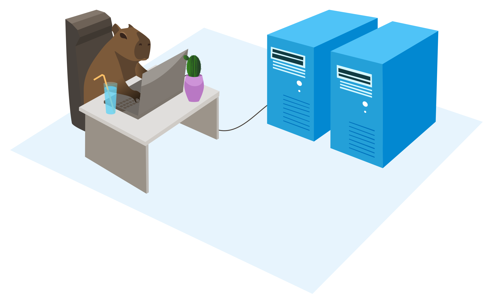

<p align="center">
  
</p>

**Capyfile** - file processing for your microservice architecture. Or for your $5/mo VPS. 

What we are pursuing here:
* Easy setup
* High customization
* Wide range of file processing operations

## Quick example

File processing service can be set up in **two simple steps**.

### 1. Prepare the service definition file.

Here's a sample `service-definition.json` file:
```json
{
  "version": "1.0",
  "name": "upload",
  "processors": [
    {
      "name": "document",
      "operations": [
        {
          "name": "file_size_validate",
          "params": {
            "maxFileSize": {
              "sourceType": "value",
              "source": 1048576
            }
          }
        },
        {
          "name": "file_type_validate",
          "params": {
            "allowedMimeTypes": {
              "sourceType": "value",
              "source": [
                "application/pdf",
                "application/msword",
                "application/vnd.openxmlformats-officedocument.wordprocessingml.document"
              ]
            }
          }
        },
        {
          "name": "s3_upload",
          "params": {
            "accessKeyId": {
              "sourceType": "secret",
              "source": "aws_access_key_id"
            },
            "secretAccessKey": {
              "sourceType": "secret",
              "source": "aws_secret_access_key"
            },
            "endpoint": {
              "sourceType": "etcd",
              "source": "/services/upload/aws_endpoint"
            },
            "region": {
              "sourceType": "etcd",
              "source": "/services/upload/aws_region"
            },
            "bucket": {
              "sourceType": "env_var",
              "source": "AWS_DOCUMENTS_BUCKET"
            }
          }
        }
      ]
    }
  ]
}
```
This service definition setting up the server that allow .pdf, .doc and .docx files that are
less than 10MB. Valid files will be uploaded to S3-compatible storage.

Available operations are:
* `file_size_validate` - check file size
* `file_type_validate` - check file MIME type
* `metadata_cleanup` - clear file metadata if possible (use exiftool)
* `s3_upload` - upload file to S3-compatible storage
* ... will be more

Operation parameters can be retrieved from these source types:
* `value` - parameter value will be retrieved from the service definition 
* `env_var` - parameter value will be retrieved from the environment variable
* `secret` - parameter value will be retrieved from the secret (docker secret)
* `file` - parameter value will be retrieved from the file
* `http_get` - parameter value will be retrieved from the HTTP GET parameter
* `http_post` - parameter value will be retrieved from the HTTP POST parameter
* `http_header` - parameter value will be retrieved from the HTTP header
* `etcd` - parameter value will be retrieved from the etcd key-value store
* ... will be more

### 2. Run the file processing server.

Now when you have a service definition file, you can run the file processing server.
```bash
# Provide service definition stored in the local filesystem 
# via CAPYFILE_SERVICE_DEFINITION_FILE=/etc/capyfile/service-definition.json
docker run \
    --name capyfile_server \
    --mount type=bind,source=./service-definition.json,target=/etc/capyfile/service-definition.json \
    --env CAPYFILE_SERVICE_DEFINITION_FILE=/etc/capyfile/service-definition.json \
    --env AWS_DOCUMENTS_BUCKET=documents \
    --secret aws_access_key_id \
    --secret aws_secret_access_key \
    -p 8024:80 \
    capyfile/capysvr:latest

# Or you can provide the service definition stored in the remote host 
# via CAPYFILE_SERVICE_DEFINITION_URL=https://example.com/service-definition.json
docker run \
    --name capyfile_server \
    --env CAPYFILE_SERVICE_DEFINITION_URL=https://example.com/service-definition.json \
    --env AWS_DOCUMENTS_BUCKET=documents \
    --secret aws_access_key_id \
    --secret aws_secret_access_key \
    -p 8024:80 \
    capyfile/capysvr:latest
```

If you want to load parameters from etcd, you can provide the etcd connection parameters via
environment variables:
```
ETCD_ENDPOINTS=["etcd1:2379","etcd2:22379","etcd3:32379"]
ETCD_USERNAME=etcd_user
ETCD_PASSWORD=etcd_password
```

Now it is ready to accept and process the files.
```bash
# upload and process single file
curl -F "file1=@$HOME/Documents/document.pdf" http://localhost/upload/document 

# upload and process request body
curl --data-binary "@$HOME/Documents/document.pdf" http://localhost/upload/document 

# upload and process multiple files
curl -F "file1=@$HOME/Documents/document.pdf" http://localhost/upload/document 
curl \
    -F "file1=@$HOME/Documents/document.pdf" \
    -F "file3=@$HOME/Documents/document.docx" \
    -F "file3=@$HOME/Documents/very-big-document.pdf" \
    -F "file4=@$HOME/Documents/program.run" \
    http://localhost/upload/document 
```

The service returns json response of this format (example for multiple files upload above):
```json
{
  "status": "PARTIAL",
  "code": "PARTIAL",
  "message": "successfully uploaded 2 of 4 files",
  "files": [
    {
      "url": "https://documents.storage.example.com/documents/abcdKDNJW_DDWse.pdf",
      "filename": "abcdKDNJW_DDWse.pdf",
      "originalFilename": "document.pdf",
      "mime": "application/pdf",
      "size": 5892728,
      "status": "SUCCESS",
      "code": "FILE_SUCCESSFULLY_UPLOADED",
      "message": "file successfully uploaded"
    },
    {
      "url": "https://documents.storage.example.com/documents/abcdKDNJW_DDWsd.docx",
      "filename": "abcdKDNJW_DDWsd.docx",
      "originalFilename": "document.docx",
      "mime": "application/vnd.openxmlformats-officedocument.wordprocessingml.document",
      "size": 3145728,
      "status": "SUCCESS",
      "code": "FILE_SUCCESSFULLY_UPLOADED",
      "message": "file successfully uploaded"
    }
  ],
  "errors": [
    {
      "originalFilename": "very-big-document.pdf",
      "status": "ERROR",
      "code": "FILE_IS_TOO_BIG",
      "message": "file size can not be greater than 10 MB"
    },
    {
      "originalFilename": "program.run",
      "status": "ERROR",
      "code": "FILE_MIME_TYPE_IS_NOT_ALLOWED",
      "message": "file MIME type \"application/x-makeself\" is not allowed"
    }
  ],
  "meta": {
    "totalUploads": 4,
    "successfulUploads": 2,
    "failedUploads": 2
  }
}
```

## Core concepts 

On paper, it supposed to look like this:

 

There are three core concepts:
* **Service**. Top layer that has access to the widest context. It is accepting input, 
setting up the processors and returning output.
* **Processor**. It's responsible for configuring the operations, building operation 
pipeline.
* **Operation**. Do the actual file processing. It can validate, modify, or store the
file.

## Development

What we have so far is a basic dev environment running on Docker.
```bash
# Build capysvr from the source code and run it with all necessary dependencies
./up.dev.sh

# now capysvr is accessible on http://localhost:8024 or http://capyfile.local:8024
# it use `service-definition.dev.json` service definition file

# Stop the dev environment
./stop.dev.sh
```

